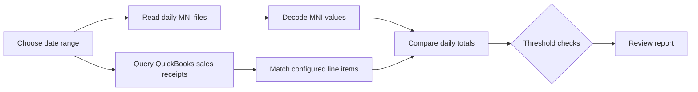

# Dona · Excel / QuickBooks Sales Reconciliation

> A desktop reconciliation utility for comparing daily MNI sales data with QuickBooks Desktop sales receipts.

Dona brings two operational records into one review: daily encoded `.mni` files exported from the sales workflow and sales-receipt data queried from a QuickBooks company file. It compares the totals, flags exceptions, and presents the review as a date-based report.

## The workflow

## What it checks

| Check | Purpose |
| --- | --- |
| Sales total | Compares decoded MNI sales with the QuickBooks total |
| Discount | Flags discounts above the configured maximum |
| Less | Flags “less” values above the configured maximum |
| Low sales | Identifies days below the configured sales threshold |
| Missing data | Highlights zero, missing, or mismatched daily records |

The report is designed to answer a practical question quickly: which dates need a human review, and why?

## QuickBooks line items

The current implementation maps these QuickBooks item names into its comparison:

- `Computer Income:Usage`
- `Computer Income:BW Printing`
- `Computer Income:Color Printing`
- `Computer Income:Scan`

If a company file uses different item names, update the mapping in `frmMain.vb` before relying on the totals.

## How to use it

1. Prepare the daily `.mni` files using the expected `MM_dd_yy.mni` naming pattern.
2. Open the application and set the date range and review thresholds.
3. Select the MNI folder and the QuickBooks company file (`.QBW`).
4. Run the report and review the flagged dates in the progress and report views.

## Requirements

- Windows
- QuickBooks Desktop with the QuickBooks Foundation Class SDK / QBFC7 available
- Access to the relevant `.QBW` company file
- The expected daily MNI files
- A compatible legacy Visual Basic / Visual Studio environment

The project targets the original .NET Framework 2.0 era and uses QuickBooks COM interop. QuickBooks Desktop may request permission for the application the first time it connects.

## Data and implementation notes

- `Module1.vb` decodes the MNI text by reversing the project's character transformation before accumulating less, discount, and sales values.
- `frmMain.vb` opens a QBFC session, queries sales receipts for the selected dates, and compares the configured line items.
- `frmProg.vb` provides progress feedback while the report is built.
- `frmReport.vb` hosts the final review output.

This repository contains the original desktop implementation and its legacy build artifacts. The README intentionally documents the real dependency chain so a future modernization can be planned safely instead of treating the project as a generic Excel import.
